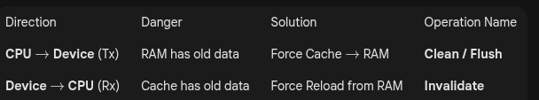
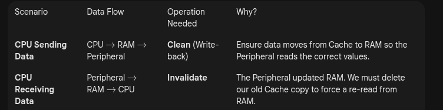

# Cache Coherency

## CPU
### L1 Cache
* Integrated directly into the CPU core.
* L1i (Instruction): Stores code. Read-only to the pipeline.
* L1d (Data): Stores variables/data. Read/Write.
* Small (e.g., 32KB - 64KB). Extremely fast, typically 1-3 clock cycles.



* `Invalidate` means `Mark this cache line as garbage and discard it`. Do not write it back to RAM.




```bash
/* CPU gives ownership to Device (Equivalent to Clean/Write-back) */
dma_sync_single_for_device(dev, dma_handle, size, DMA_TO_DEVICE);

/* Device gives ownership to CPU (Equivalent to Invalidate) */
dma_sync_single_for_cpu(dev, dma_handle, size, DMA_FROM_DEVICE);
```
### The CPU vs. The Interrupt (Atomicity)

* The Problem: An interrupt can hijack the CPU PC (Program Counter) in the middle of a Read-Modify-Write sequence.
* The Solution: Disable Interrupts globally (local_irq_save / local_irq_restore) around critical sections.

### The CPU vs. The DMA (Coherence)

* The Problem: The CPU sees Cache; the DMA sees RAM. They are out of sync.

* The Solution:
- Sending (Tx): You must Clean (Flush) the cache before the DMA starts. (Push data to RAM).
- Receiving (Rx): You must Invalidate the cache before the CPU reads. (Force reload from RAM).

