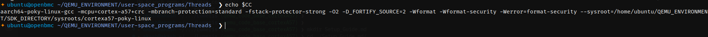

# Ubuntu Setup for Qemu

## Packages Installation
```bash
sudo apt install gawk wget git diffstat unzip texinfo gcc build-essential chrpath socat cpio python3 python3-pip python3-pexpect xz-utils debianutils iputils-ping python3-git python3-jinja2 libegl1-mesa libsdl1.2-dev pylint3 xterm zstd
```

## Steps to setup Yocto
* Step-I
```bash
git clone -b scarthgap git://git.yoctoproject.org/poky
source poky/oe-init-build-env
```
* Step-II
- 0pen conf/local.conf to make Target as QEMU ARM64 machine.
```bash
MACHINE ?= "qemuarm64"

# Optional: Add 'debug-tweaks' to allow passwordless root login (useful for dev)
EXTRA_IMAGE_FEATURES ?= "debug-tweaks ssh-server-openssh"
```
* Step-III
```bash
bitbake core-image-minimal
```
* Step-IV
- Once build is completed from the same folder execute the below :
```bash
runqemu qemuarm64 nographic
```

* Step-V
- Build the SDK for setting up the cross-compilation setup's.
```bash
bitbake core-image-minimal -c populate_sdk
sudo sh tmp/deploy/sdk/poky-glibc-x86_64-core-image-minimal-cortexa57-qemuarm64-toolchain-5.0.14.sh 
```
- Give the directory path where you want to install the SDK.

* STEP-VI
- Source the environment.
```bash
. /home/ubuntu/QEMU_ENVIRONMENT/SDK_DIRECTORY/environment-setup-cortexa57-poky-linux
echo $CC
```
- Sample of $CC


* STEP-VII
- Cross compile the C app after sourcing like the above.
```bash
$CC endian_check.c -o endian_check
```
- Once compiled copy the app into the qemu and execute.


## YOCTO COMMANDS USEFUL
* To clean any app or recipe
```bash
bitbake -c cleansstate
```

